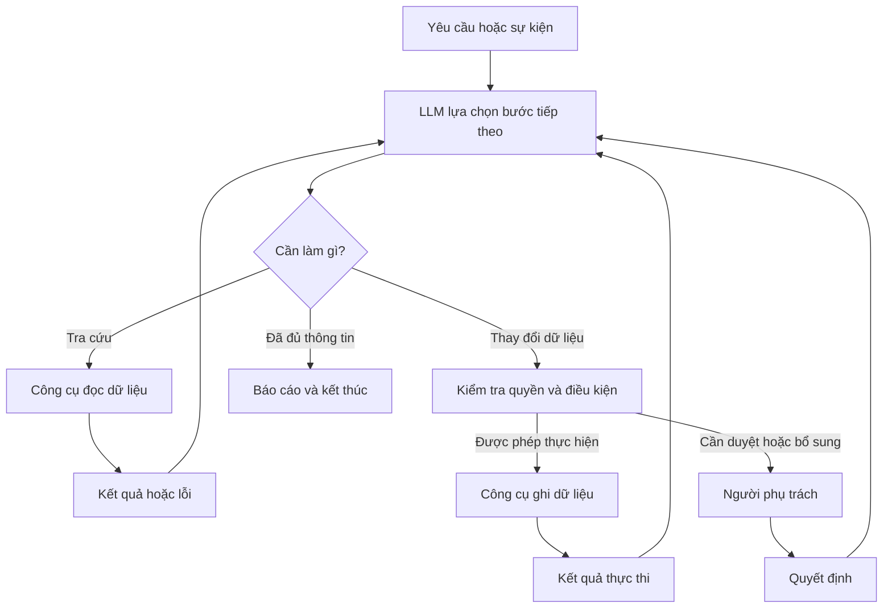

# Ứng dụng mạng nơ-ron trong LLM & AI Agent

> **Tác nhân và tự động hóa công việc** — tài liệu tổng hợp phát triển, đã qua audit & kaizen.
> **Luận điểm cốt lõi:** Có thể xây tác nhân bằng cách kết hợp **LLM có sẵn**,
> **dữ liệu doanh nghiệp**, **công cụ thực hiện công việc** và **quy trình kiểm tra**.
> Mạng nơ-ron cung cấp khả năng xử lý ngôn ngữ, hình ảnh và tìm kiếm ngữ nghĩa;
> phần mềm điều phối kết nối những khả năng đó với công việc thực tế.
> **Phạm vi:** Các quy trình áp dụng cho doanh nghiệp trong tài liệu là thiết kế đề xuất,
> chưa được kiểm thử trên dữ liệu thực tế của từng đơn vị.

## Mục lục

1. [Ba cách sử dụng AI: Hỏi đáp / Workflow / Agent](#1-ba-cách-sử-dụng-ai-hỏi-đáp--workflow--agent)
2. [Mạng nơ-ron ở đâu trong LLM và hệ thống truy xuất](#2-mạng-nơ-ron-ở-đâu-trong-llm-và-hệ-thống-truy-xuất)
3. [Vòng lặp tác nhân (Agentic Loop) — đặc tả chuẩn hóa](#3-vòng-lặp-tác-nhân-agentic-loop--đặc-tả-chuẩn-hóa)
4. [Thiết kế công cụ (Tool Design)](#4-thiết-kế-công-cụ-tool-design)
5. [Human-in-the-loop và kiểm soát quyền](#5-human-in-the-loop-và-kiểm-soát-quyền)
6. [Bảo mật cho agent doanh nghiệp](#6-bảo-mật-cho-agent-doanh-nghiệp)
7. [Khả năng quan sát (Observability)](#7-khả-năng-quan-sát-observability)
8. [Các tác nhân cho doanh nghiệp](#8-các-tác-nhân-cho-doanh-nghiệp)
9. [Ví dụ chi tiết: tác nhân kiểm tra đơn xuất kho](#9-ví-dụ-chi-tiết-tác-nhân-kiểm-tra-đơn-xuất-kho)
10. [Triển khai bằng n8n](#10-triển-khai-bằng-n8n)
11. [Khi cần lập trình: chọn n8n / LangGraph / Custom code](#11-khi-cần-lập-trình-chọn-n8n--langgraph--custom-code)
12. [Chọn phương pháp: RAG / Tool-calling / State / Fine-tuning](#12-chọn-phương-pháp-rag--tool-calling--state--fine-tuning)
13. [Đánh giá bản thử nghiệm (Pilot Eval)](#13-đánh-giá-bản-thử-nghiệm-pilot-eval)
14. [Mẫu multi-agent](#14-mẫu-multi-agent)
15. [Mẫu prompt cho agent kho](#15-mẫu-prompt-cho-agent-kho)
16. [Nguồn tham khảo](#16-nguồn-tham-khảo)
17. [Tích hợp vào dự án](#17-tích-hợp-vào-dự-án)
18. [Ghi chú audit & kaizen](#18-ghi-chú-audit--kaizen)

---

## 1. Ba cách sử dụng AI: Hỏi đáp / Workflow / Agent

| Cách sử dụng | Cách tổ chức | Ví dụ |
|---|---|---|
| Hỏi đáp với LLM | Nhận đầu vào và sinh câu trả lời. | Giải thích một quy trình nhập kho. |
| Workflow có AI | Các bước được thiết kế trước; AI xử lý một số bước. | Nhận hóa đơn → trích xuất → đối chiếu → đưa vào danh sách chờ. |
| AI agent | Mô hình lựa chọn công cụ và bước tiếp theo dựa trên kết quả vừa nhận. | Kiểm tra đơn hàng; thiếu hàng thì tra tiếp kế hoạch sản xuất. |

Một hệ thống có thể **kết hợp workflow và agent**. Cách phân biệt này được trình bày
trong tài liệu kiến trúc của Anthropic. [01]

**Quy tắc chọn:**
- Đầu ra đơn giản, một bước → Hỏi đáp.
- Quy trình cố định, lặp lại, cần kiểm soát chặt → Workflow có AI.
- Nhiệm vụ mở, cần tra cứu linh hoạt theo tình huống → Agent.

---

## 2. Mạng nơ-ron ở đâu trong LLM và hệ thống truy xuất

### 2.1. Trong LLM kiểu Transformer

Trong LLM kiểu Transformer: **embedding** chuyển token thành vector, **attention**
kết hợp thông tin theo ngữ cảnh, các lớp **feed-forward** tiếp tục biến đổi biểu diễn.
Với mô hình sinh văn bản tự hồi quy, đầu ra được dùng để dự đoán token tiếp theo. [02] [03]

| Thành phần | Vai trò | Ứng dụng đề xuất |
|---|---|---|
| LLM | Xử lý yêu cầu bằng ngôn ngữ; tạo văn bản hoặc yêu cầu gọi công cụ. | Chọn công cụ kiểm tra đơn hàng và soạn báo cáo. |
| Embedding | Biểu diễn câu hỏi và tài liệu thành vector để tìm kiếm ngữ nghĩa. | Tìm đoạn SOP dù câu hỏi dùng cách diễn đạt khác. |
| Reranker | Chấm mức liên quan giữa câu hỏi và tài liệu; xếp lại các đoạn trước khi đưa vào câu trả lời. | Xếp lại các đoạn SOP trước khi sinh câu trả lời. |
| Mô hình đa phương thức | Kết hợp chữ, vị trí chữ và hình ảnh. | Trích thông tin từ hóa đơn, phiếu giao hàng, biểu mẫu. |

> Embedding và reranker là hai thành phần **riêng** trong truy xuất và xếp hạng.
> Mô hình hỏi đáp tài liệu có thể sử dụng chữ, bố cục và hình ảnh. [04] [05]

### 2.2. Vai trò của công cụ (Tool Use)

Với công cụ do ứng dụng cung cấp, LLM tạo **yêu cầu gọi hàm có cấu trúc**;
ứng dụng thực thi hàm rồi trả kết quả cho mô hình.
Ví dụ: mô hình yêu cầu `get_stock`, còn API hoặc chương trình kết nối ERP
thực hiện việc lấy tồn kho. [06]

> **Nguyên tắc phân công:** Giao phép tính, đối chiếu mã, kiểm tra ngày và điều kiện
> nghiệp vụ cho **SQL, công thức hoặc chương trình**. Dùng **LLM** ở các phần cần
> xử lý văn bản, giải thích kết quả và lựa chọn bước tra cứu.

---

## 3. Vòng lặp tác nhân (Agentic Loop) — đặc tả chuẩn hóa

> Chuẩn hóa từ sơ đồ hoạt động của tác nhân (ảnh đính kèm), đã bổ sung các cơ chế
> bảo vệ (guards) còn thiếu trong sơ đồ gốc — xem mục 18.

### 3.1. Sơ đồ



### 3.2. Đặc tả vòng lặp (pseudocode)

```text
function run_agent(request, config):
    state = init_state(request)
    for step in 1..config.max_steps:                      # GUARD: giới hạn số bước
        if elapsed() > config.timeout: break              # GUARD: timeout
        action = llm.choose_next_step(state)              # LLM lựa chọn
        match action.type:
            case READ:
                result = read_tool.execute(action)        # công cụ đọc: luôn cho phép
                state.add(result_or_error)
            case WRITE:
                verdict = check_permission(action)        # kiểm tra quyền & điều kiện
                if verdict == ALLOW:
                    result = write_tool.execute(action)   # công cụ ghi
                    state.add(result)
                else:
                    decision = ask_human(action)           # người phụ trách quyết định
                    state.add(decision)                   # duyệt / từ chối / bổ sung
            case FINISH:
                return report(state)                      # báo cáo và kết thúc
    return report(state, truncated=true)                  # GUARD: dừng cưỡng bức
```

### 3.3. Các cơ chế bảo vệ bắt buộc (Guards)

| Guard | Giá trị gợi ý | Lý do |
|---|---|---|
| `max_steps` | 10–25 tùy độ phức tạp | Chống vòng lặp vô hạn khi LLM chọn bước lặp lại |
| `timeout` | 2–10 phút / tác vụ | Chống treo khi công cụ chậm |
| `max_tool_calls` | theo ngân sách | Mỗi lần gọi tool tốn token + thời gian |
| Cost budget | trần chi phí / tác vụ | LLM + embedding đều tính phí theo usage |
| Điều kiện dừng | FINISH hoặc hết guard | Mọi tác vụ có phạm vi rõ ràng |

> **Phần agentic nằm ở việc lựa chọn bước tiếp theo:** kết quả tồn kho quyết định
> có cần tra thêm kế hoạch sản xuất hoặc quy trình xử lý hay không. Cách tổ chức
> vòng lặp hành động và nhận kết quả được trình bày trong tài liệu về agent và
> nghiên cứu ReAct. [07] [08]

---

## 4. Thiết kế công cụ (Tool Design)

Dựa trên khuyến nghị viết công cụ hiệu quả cho agent. [16]

### 4.1. Nguyên tắc

1. **Tên rõ nghĩa, động từ đầu:** `get_order`, `get_available_stock`, `search_sop`, `create_draft_report`.
2. **Mô tả chính xác điều kiện dùng:** khi nào gọi, dữ liệu trả về dạng gì, giới hạn nào.
3. **Tham số có JSON Schema chặt:** kiểu, bắt buộc/tùy chọn, ví dụ, enum cho mã trạng thái.
4. **Lỗi trả về có cấu trúc:** mã lỗi + thông điệp + gợi ý bước tiếp theo (để LLM tự phục hồi).
5. **Công cụ ghi phải idempotent:** gọi lại cùng tham số không tạo tác dụng phụ kép
   (dùng idempotency key).
6. **Tách công cụ đọc và ghi:** đọc luôn cho phép; ghi luôn qua kiểm tra quyền (mục 3, 5).

### 4.2. Ví dụ JSON Schema cho cụm công cụ kho

```json
{
  "get_order": {
    "description": "Lấy chi tiết đơn hàng theo mã đơn.",
    "parameters": {
      "type": "object",
      "properties": {
        "order_id": { "type": "string", "description": "Mã đơn hàng, ví dụ DH001" }
      },
      "required": ["order_id"]
    }
  },
  "get_available_stock": {
    "description": "Lấy tồn khả dụng theo mã hàng, size, kho và trạng thái QC.",
    "parameters": {
      "type": "object",
      "properties": {
        "sku": { "type": "string" },
        "size": { "type": "string" },
        "warehouse": { "type": "string", "enum": ["vattu", "thanhpham"] },
        "qc_status": { "type": "string", "enum": ["passed", "pending", "failed"], "default": "passed" }
      },
      "required": ["sku"]
    }
  },
  "create_draft_report": {
    "description": "Tạo báo cáo dự thảo. KHÔNG gửi cho khách hàng khi chưa được duyệt.",
    "parameters": {
      "type": "object",
      "properties": {
        "title": { "type": "string" },
        "rows": { "type": "array", "items": { "type": "object" } },
        "sources": { "type": "array", "items": { "type": "string" } }
      },
      "required": ["title", "rows", "sources"]
    }
  }
}
```

---

## 5. Human-in-the-loop và kiểm soát quyền

### 5.1. Ma trận quyết định

| Loại hành động | Ví dụ | Xử lý |
|---|---|---|
| Đọc dữ liệu | Tra tồn kho, tìm SOP | Luôn cho phép, ghi log |
| Ghi dữ liệu nội bộ, ít rủi ro | Tạo báo cáo nháp, lưu trạng thái | Cho phép nếu đủ điều kiện, ghi log |
| Ghi dữ liệu có tác động | Cập nhật tồn kho, gửi email | **Bắt buộc người duyệt** trước khi thực thi |
| Hành động ra bên ngoài | Gửi tin nhắn cho khách hàng, cam kết giao hàng | **Bắt buộc người duyệt** + lưu bằng chứng duyệt |

### 5.2. Mẫu thực thi có duyệt

```text
1. Agent soạn hành động + bản xem trước (dry-run / preview).
2. Hệ thống gửi yêu cầu duyệt cho người phụ trách (kèm ngữ cảnh: dữ liệu nguồn, lý do).
3. Người phụ trách: DUYỆT / TỪ CHỐI / YÊU CẦU BỔ SUNG.
4. Chỉ khi DUYỆT mới thực thi công cụ ghi; mọi bước ghi vào audit log.
```

n8n có cơ chế yêu cầu người duyệt trước khi thực thi một số công cụ được chọn. [11]

---

## 6. Bảo mật cho agent doanh nghiệp

| Hạng mục | Biện pháp |
|---|---|
| Phân quyền tối thiểu | Mỗi công cụ chỉ có quyền đúng phạm vi cần; khóa API riêng cho agent, không dùng khóa admin chung. |
| Quản lý bí mật | Khóa, token lưu trong secret manager / biến môi trường mã hóa; không đưa vào prompt, log hay báo cáo. |
| Dữ liệu nhạy cảm | Không để agent truy cập dữ liệu ngoài phạm vi nhiệm vụ; redact PII trong log và báo cáo. |
| Chống prompt injection | Coi mọi dữ liệu từ công cụ/tài liệu là **không đáng tin**; không thực thi chỉ dẫn lạ trong dữ liệu truy xuất; tách kênh lệnh và dữ liệu. |
| Nhật ký kiểm tra | Ghi lại: ai yêu cầu, agent nào, công cụ nào, tham số, kết quả, ai đã duyệt (cho hành động ghi). |
| Giới hạn tác động | Công cụ ghi có idempotency key; có cơ chế rollback/hoàn tác cho thao tác quan trọng. |

---

## 7. Khả năng quan sát (Observability)

Mỗi lượt chạy agent nên lưu một **trace** với cấu trúc tối thiểu:

```json
{
  "trace_id": "uuid",
  "task": "kiem-tra-don-DH001",
  "started_at": "2026-09-30T08:00:00+07:00",
  "steps": [
    { "n": 1, "action": "get_order", "args": {"order_id": "DH001"}, "status": "ok", "ms": 320 },
    { "n": 2, "action": "get_available_stock", "args": {"sku": "A-38"}, "status": "ok", "ms": 410 },
    { "n": 3, "action": "FINISH", "status": "ok" }
  ],
  "tokens_used": 8450,
  "cost_estimate": 0.021,
  "human_approvals": []
}
```

Dùng trace để: debug khi agent sai, đo thời gian/chi phí mỗi tác vụ (mục 13),
phát hiện vòng lặp bất thường, làm bằng chứng kiểm toán.

---

## 8. Các tác nhân cho doanh nghiệp

> Các dòng dưới đây là những tác nhân có thể thiết kế cho công việc kho, sản xuất,
> kế toán và nhân sự; không phải kết quả triển khai đã được xác nhận.

| Tác nhân | Dữ liệu đầu vào | Công việc được thiết kế | Đầu ra |
|---|---|---|---|
| Tra cứu quy trình kho | SOP, hướng dẫn đóng gói, quy định khách hàng. | Tìm tài liệu liên quan, lọc phiên bản, tổng hợp nội dung có dẫn nguồn. | Câu trả lời kèm tên tài liệu, phiên bản và đoạn căn cứ. |
| Kiểm tra khả năng xuất hàng | Đơn hàng, tồn theo mã-size-lô, trạng thái QC, hàng đã giữ. | Tra tồn khả dụng; tính thiếu; tra kế hoạch hoàn thành nếu cần. | Bảng đủ/thiếu theo size và danh sách việc cần xử lý. |
| Tiếp nhận hóa đơn | Hóa đơn, đơn mua hàng, phiếu nhận hàng. | Trích trường dữ liệu; đối chiếu mã hàng, số lượng, đơn giá bằng quy tắc. | Danh sách khớp, chênh lệch hoặc cần kiểm tra. |
| Theo dõi công nợ | Sổ công nợ, hạn thanh toán, lịch sử đối chiếu. | Tính tuổi nợ bằng chương trình; tổng hợp hồ sơ; soạn nội dung nhắc nợ. | Báo cáo công nợ và bản nháp liên hệ. |
| Theo dõi hồ sơ nhân sự | HĐLĐ, danh sách nhân viên, hồ sơ còn thiếu. | Trích ngày và thông tin; kiểm tra theo danh mục yêu cầu đã cấu hình. | Danh sách hồ sơ cần bổ sung, mốc cần theo dõi. |
| Phân tích lỗi sản xuất | Ảnh lỗi, kết quả kiểm tra, mã lô, SOP xử lý. | Mô hình thị giác phân loại ảnh; tác nhân tìm quy trình và tập hợp bằng chứng. | Hồ sơ sự cố để người phụ trách đánh giá. |
| Tổng hợp trao đổi song ngữ | Email, tin nhắn, biên bản công việc. | Trích đầu việc, người phụ trách, thời hạn; tạo bản nháp song ngữ (Việt–Trung / Việt–Hàn). | Danh sách công việc và báo cáo chờ rà soát. |

---

## 9. Ví dụ chi tiết: tác nhân kiểm tra đơn xuất kho

**Ví dụ giả lập, không phải dữ liệu của doanh nghiệp bạn.**
Yêu cầu mẫu: *"Kiểm tra đơn DH001 và lập danh sách hàng còn thiếu."*

### 9.1. Công cụ có thể thiết kế

| Công cụ | Chức năng |
|---|---|
| `get_order` | Lấy chi tiết đơn hàng. |
| `get_available_stock` | Lấy tồn khả dụng theo mã, size, kho và trạng thái. |
| `get_production_plan` | Lấy kế hoạch hoàn thành phần hàng thiếu. |
| `search_sop` | Tra quy trình liên quan. |
| `create_draft_report` | Tạo báo cáo dự thảo. |

### 9.2. Dữ liệu minh họa do công cụ trả về

| Mã-size | Đơn cần | Tồn khả dụng | Thiếu |
|---|---|---|---|
| A-38 | 100 đôi | 80 đôi | 20 đôi |
| A-39 | 120 đôi | 150 đôi | 0 đôi |

### 9.3. Quy trình đề xuất

1. Lấy đúng đơn hàng và thời điểm cập nhật tồn.
2. **Chương trình** tính thiếu theo từng mã-size (không để LLM tính tay).
3. Khi có thiếu hàng, tra tiếp kế hoạch sản xuất.
4. Nếu chưa có ngày hoàn thành được xác nhận, ghi rõ trường thông tin còn thiếu.
5. Tạo bảng kết quả cùng nguồn dữ liệu để người phụ trách quyết định.

### 9.4. Diễn giải agentic

Phần agentic nằm ở **việc lựa chọn bước tiếp theo**: kết quả tồn kho quyết định
có cần tra thêm kế hoạch sản xuất hoặc quy trình xử lý hay không — đúng vòng lặp ở mục 3.

---

## 10. Triển khai bằng n8n

> Có thể bắt đầu với cấu trúc sau, sau đó điều chỉnh theo hệ thống dữ liệu
> và quyền truy cập thực tế của doanh nghiệp.

| Thành phần | Cấu hình đề xuất |
|---|---|
| Đầu vào | Chat Trigger để nhận câu hỏi; hoặc Webhook nhận sự kiện. |
| AI Agent | Gắn một Chat Model có hỗ trợ gọi công cụ. |
| Công cụ dữ liệu | HTTP Request hoặc workflow con để đọc ERP, cơ sở dữ liệu hay bảng dữ liệu. |
| Công cụ tra cứu | Tìm SOP và trả về nội dung cùng thông tin phiên bản. |
| Kiểm tra nghiệp vụ | Code hoặc nhánh điều kiện kiểm tra số liệu, mã và trường bắt buộc. |
| Thực hiện thay đổi | Công cụ ghi với quyền cụ thể; cấu hình duyệt cho hành động cần người quyết định. |
| Theo dõi | Lưu trạng thái tác vụ, dữ liệu tham chiếu, công cụ đã gọi và kết quả. |

Tài liệu n8n xác nhận AI Agent kết nối với chat model và ít nhất một công cụ;
Tools Agent hỗ trợ công cụ HTTP, Code và workflow con. [09] [10]

---

## 11. Khi cần lập trình: chọn n8n / LangGraph / Custom code

Nếu cần lập trình luồng phức tạp, lưu trạng thái và tiếp tục công việc sau gián đoạn,
LangGraph là một lựa chọn để nghiên cứu. Tài liệu của framework mô tả việc kết hợp
bước có quy tắc cố định với bước do LLM điều khiển. [12]

| Tiêu chí | n8n | LangGraph | Custom code |
|---|---|---|---|
| Tốc độ dựng thử nghiệm | Nhanh nhất, kéo-thả | Trung bình | Chậm nhất |
| Luồng phức tạp, rẽ nhánh sâu | Hạn chế | Tốt (đồ thị trạng thái) | Tốt nhất |
| Lưu trạng thái / tiếp tục sau gián đoạn | Cơ bản | Có sẵn (persistence) | Tự xây |
| Human-in-the-loop | Có sẵn [11] | Tự định nghĩa node | Tự xây |
| Kiểm soát chi tiết guard/timeout | Hạn chế | Tốt | Toàn quyền |
| Đội ngũ phù hợp | Ít code | Biết Python | Kỹ sư phần mềm |

**Khuyến nghị:** bắt đầu bằng n8n cho bản thử nghiệm (mục 13); chuyển sang LangGraph
khi luồng vượt quá khả năng biểu diễn của n8n hoặc cần persistence mạnh.

---

## 12. Chọn phương pháp: RAG / Tool-calling / State / Fine-tuning

RAG, gọi công cụ, lưu trạng thái và fine-tuning là những quyết định **khác nhau**,
có thể kết hợp.

| Nhu cầu | Hướng triển khai đề xuất |
|---|---|
| Trả lời dựa trên SOP, hướng dẫn, tài liệu nội bộ | **RAG:** truy xuất tài liệu liên quan rồi đưa vào ngữ cảnh. |
| Xem tồn kho, đơn hàng, công nợ đang thay đổi | **Gọi API/công cụ:** lấy dữ liệu tại thời điểm xử lý. |
| Ghi nhận công việc qua nhiều bước | **Lưu trạng thái:** dùng cơ sở dữ liệu hoặc cơ chế persistence. |
| Điều chỉnh cách xử lý một nhiệm vụ chuyên biệt bằng dữ liệu mẫu | **Đánh giá fine-tuning hoặc LoRA** sau khi có bộ kiểm thử. |

RAG kết hợp truy xuất với mô hình sinh; fine-tuning là huấn luyện bổ sung.
LoRA học các ma trận cập nhật hạng thấp. Việc lưu lịch sử hoặc thêm tài liệu
vào kho tra cứu **tự nó không phải** là bước huấn luyện lại trọng số. [13] [14] [15]

---

## 13. Đánh giá bản thử nghiệm (Pilot Eval)

> Bắt đầu bằng tác nhân *"kiểm tra đơn hàng và tồn khả dụng"*, dùng dữ liệu xuất
> từ Excel trước khi kết nối ERP.

### 13.1. Tiêu chí đúng/sai

- Lấy đúng đơn, mã hàng, size và phiên bản dữ liệu.
- Tính đúng phần thiếu theo từng dòng.
- Nhận ra trường hợp dữ liệu thiếu hoặc công cụ lỗi.
- Báo cáo có căn cứ truy lại được (trace + nguồn).

### 13.2. Tiêu chí vận hành

- Đo **thời gian**, **số lần gọi công cụ** và **chi phí** mỗi tác vụ.
- Tỷ lệ tác vụ cần người can thiệp (human intervention rate).
- Tỷ lệ chọn đúng công cụ (tool-call accuracy) trên bộ kiểm thử vàng.

Cách đánh giá theo kết quả kiểm chứng được, đồng thời theo dõi thời gian, lỗi và
số lượt gọi công cụ, được khuyến nghị trong tài liệu phát triển công cụ cho agent. [16]

### 13.3. Khung triển khai pilot

```text
Tuần 1-2:  Dựng agent + 3-5 công cụ đọc trên dữ liệu Excel mẫu.
Tuần 3-4:  Chạy 20-50 tác vụ mẫu, chấm theo 13.1 + 13.2, sửa prompt/tool.
Tuần 5-6:  Thêm 1 công cụ ghi có human-in-the-loop, kết nối nguồn dữ liệu thật (read-only).
Sau đó:     Mở rộng dần phạm vi khi các chỉ số đạt ngưỡng chấp nhận đã định trước.
```

---

## 14. Mẫu multi-agent

Khi một agent đơn không còn đủ (nhiệm vụ lớn, nhiều chuyên môn), tách thành nhiều
agent phối hợp — tương thích với mô hình group chat (ví dụ trên Cue).

| Mẫu | Cách tổ chức | Khi dùng |
|---|---|---|
| Supervisor | 1 agent điều phối chia việc cho các agent chuyên môn, tổng hợp kết quả. | Nhiệm vụ phức hợp nhiều bước khác loại. |
| Handoff | Agent A làm xong phần việc thì chuyển toàn bộ ngữ cảnh cho agent B. | Quy trình nối tiếp (ví dụ: kiểm hàng → lập báo cáo → gửi khách). |
| Group chat | Nhiều agent cùng trao đổi trong một cuộc hội thoại, tự phân công. | Cần linh hoạt, ít cấu trúc sẵn. |
| Song song | Chia nhỏ tác vụ độc lập, chạy đồng thời, gộp kết quả. | Kiểm tra nhiều đơn hàng / nhiều kho cùng lúc. |

**Nguyên tắc:** mỗi agent có trách nhiệm hẹp, công cụ riêng, và ngưỡng phê duyệt riêng;
luôn có một đầu mối chịu trách nhiệm tổng hợp cuối cùng.

---

## 15. Mẫu prompt cho agent kho

```text
Bạn là trợ lý quản lý kho của công ty sản xuất giày (gia công OEM).
Dữ liệu: kho vật tư (cao su, hóa chất, vải, khoen, chỉ, thùng/hộp/tem, vật tư
sửa chữa máy) và kho thành phẩm (nhập – xuất – kiểm hàng – tồn kho).

QUY TẮC CÔNG CỤ:
- Mọi con số (tồn kho, thiếu hụt, đối chiếu) PHẢI lấy từ công cụ, không tính nhẩm.
- Công cụ đọc: dùng tự do. Công cụ ghi: chỉ dùng sau khi tôi phê duyệt.
- Khi công cụ báo lỗi: thử lại tối đa 2 lần, sau đó báo cáo và dừng.

QUY TẮC BÁO CÁO:
- Mọi kết luận kèm nguồn: tên công cụ + thời điểm lấy dữ liệu.
- Trường dữ liệu nào còn thiếu phải ghi rõ, không tự điền.

NGƯỠNG PHÊ DUYỆT:
- Tự làm: tra cứu, tổng hợp, soạn nháp.
- Cần duyệt: gửi tin nhắn/email cho khách hàng, mọi cam kết số lượng/tiến độ,
  mọi thay đổi dữ liệu tồn kho.

BẢO MẬT:
- Không tiết lộ thông tin sản xuất, giá cả, dữ liệu nội bộ ra bên ngoài.
- Giao tiếp với tôi bằng tiếng Việt; soạn tin cho khách hàng Trung Quốc
  bằng tiếng Trung Giản thể, lịch sự, đúng thuật ngữ kho vận.
```

---

## 16. Nguồn tham khảo

> Các nguồn đã được tra cứu trong tài liệu gốc ngày 30/09/2026.

| Mã | Tên tài liệu | Tác giả / Đơn vị | Địa chỉ |
|---|---|---|---|
| [01] | Building Effective AI Agents | Anthropic | https://www.anthropic.com |
| [02] | Attention Is All You Need | Vaswani và cộng sự | https://arxiv.org |
| [03] | Training a causal language model from scratch | Hugging Face | https://huggingface.co |
| [04] | Retrieve and Re-Rank | Sentence Transformers | https://sbert.net |
| [05] | Document question answering | Hugging Face | https://huggingface.co |
| [06] | Tool use with Claude | Claude Platform Docs | https://platform.claude.com |
| [07] | What is an Agent | Hugging Face Agents Course | https://huggingface.co |
| [08] | ReAct: Synergizing Reasoning and Acting in Language Models | Yao và cộng sự | https://arxiv.org |
| [09] | AI Agent | n8n Docs | https://docs.n8n.io |
| [10] | Tools Agent | n8n Docs | https://docs.n8n.io |
| [11] | Human-in-the-loop for tools | n8n Docs | https://docs.n8n.io |
| [12] | LangGraph overview | LangChain Docs | https://docs.langchain.com |
| [13] | Retrieval-Augmented Generation for Knowledge-Intensive NLP Tasks | Lewis và cộng sự | https://arxiv.org |
| [14] | How do Transformers work | Hugging Face LLM Course | https://huggingface.co |
| [15] | LoRA: Low-Rank Adaptation of Large Language Models | Hu và cộng sự | https://arxiv.org |
| [16] | Writing effective tools for AI agents | Anthropic | https://www.anthropic.com |

---

## 17. Tích hợp vào dự án

### 17.1. Cấu trúc machine-readable

- **YAML frontmatter**: `title`, `version`, `tags`, `total_sources`, `status` → lọc/phân loại tài liệu.
- **Heading phân cấp** (`##`, `###`) → mỗi section là một chunk RAG tự nhiên.
- **Mã nguồn `[01]`–`[16]`** là anchor ổn định → tra cứu chéo.
- **Khối `mermaid`** ở mục 3.1 → render trực tiếp thành sơ đồ trong docs/VitePress/Docusaurus.
- **Khối `json`/`text`** (schema công cụ, trace, prompt) → copy trực tiếp vào code.

### 17.2. Pipeline gợi ý

```text
markdown → split theo ## / ### → chunk (~800 ký tự, overlap 100)
       → embedding → vector DB (pgvector / Qdrant / Chroma)
       → RAG: truy vấn theo chủ đề hoặc mã nguồn [01]–[16]
```

### 17.3. Quy ước file trong dự án

```text
ung-dung-mang-no-ron-llm-ai-agent.md   # file tổng (file này)
agent-kho-vattu/                        # thư mục 1 agent
  ├── prompt.md                         # mẫu prompt (mục 15, đã tailor)
  ├── tools.json                        # schema công cụ (mục 4.2, 9.1)
  └── eval-golden.json                  # bộ kiểm thử vàng (mục 13)
pilot-log-YYYY-MM-DD.md                 # nhật ký chạy thử
```

### 17.4. Mở rộng

- Tăng `version` khi bổ sung nguồn; giữ nguyên mã `[01]`–`[16]`.
- Mỗi agent triển khai thực tế tách thành thư mục riêng theo 17.3.
- Đồng bộ với file tri thức mạng nơ-ron (`ban-do-kien-thuc-mang-no-ron-ai.md`):
  hai file dùng chung quy ước frontmatter và mã nguồn để tra cứu chéo.

---

## 18. Ghi chú audit & kaizen

Những điểm đã được rà soát và cải tiến so với tài liệu gốc (PDF + sơ đồ ảnh):

| # | Phát hiện audit | Kaizen đã áp dụng |
|---|---|---|
| 1 | Sơ đồ vòng lặp thiếu cơ chế dừng, giới hạn bước, timeout | Chuẩn hóa thành đặc tả pseudocode + bảng Guards (mục 3.2, 3.3) |
| 2 | Sơ đồ chỉ ở dạng ảnh, khó tái sử dụng trong docs | Vẽ lại bằng Mermaid, render trực tiếp trong Markdown (mục 3.1) |
| 3 | Chưa có schema cụ thể cho công cụ | Thêm JSON Schema mẫu cho cụm công cụ kho (mục 4.2) |
| 4 | Chưa có nguyên tắc thiết kế tool | Thêm 6 nguyên tắc + idempotency (mục 4.1) |
| 5 | Human-in-the-loop chỉ nhắc sơ lược | Thêm ma trận quyết định + mẫu thực thi có duyệt (mục 5) |
| 6 | Thiếu hoàn toàn mảng bảo mật | Thêm checklist 6 hạng mục: phân quyền, secret, PII, prompt injection, audit log, rollback (mục 6) |
| 7 | Thiếu observability | Thêm schema trace JSON chuẩn (mục 7) |
| 8 | Chưa có tiêu chí so sánh n8n vs lập trình | Thêm ma trận quyết định 6 tiêu chí (mục 11) |
| 9 | Đánh giá pilot còn sơ lược | Mở rộng 3 nhóm tiêu chí + khung triển khai theo tuần (mục 13) |
| 10 | Thiếu mẫu multi-agent | Thêm 4 mẫu (supervisor/handoff/group chat/song song) — liên quan trực tiếp group chat trên Cue (mục 14) |
| 11 | Chưa có prompt mẫu áp dụng được ngay | Thêm mẫu prompt agent kho, có quy tắc song ngữ Việt–Trung (mục 15) |
| 12 | Bảng trong PDF bị vỡ định dạng khi trích xuất | Chuẩn hóa toàn bộ bảng Markdown, sửa tiêu đề cột |
| 13 | Ví dụ "Tổng hợp trao đổi Việt-Hàn" chưa sát với người dùng | Mở rộng thành song ngữ Việt–Trung / Việt–Hàn, gắn với nhu cầu thực tế |

*— Hết tài liệu —*
